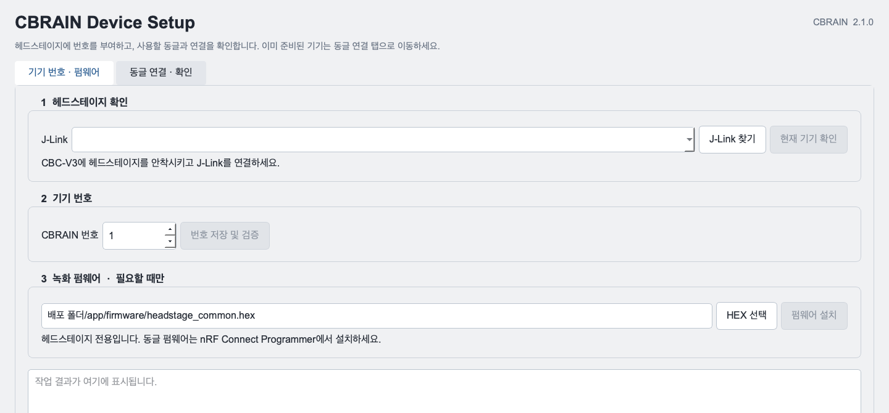
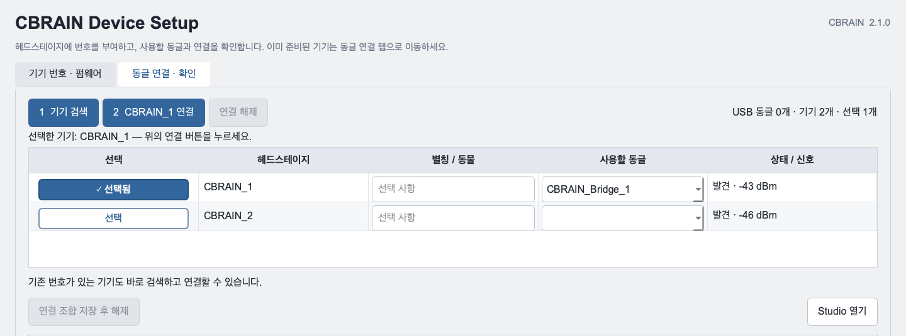
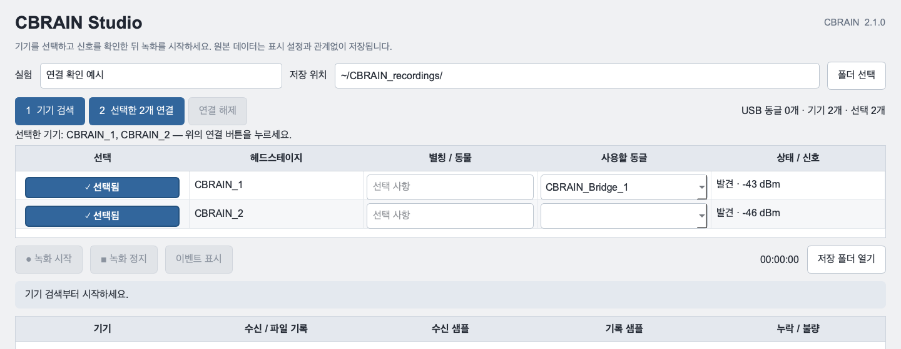
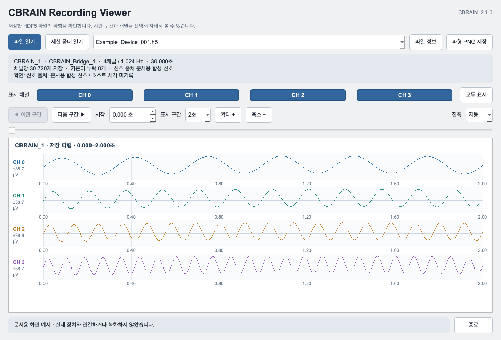

# CBRAIN Studio 2.1.0 사용 매뉴얼

하드웨어 준비부터 여러 기기 녹화, 저장 파일 확인까지

문서 기준일: 2026-09-16 | 대상: macOS Apple Silicon 배포판

처음 사용하는 사람은 1번부터 순서대로 진행합니다. 이미 준비된 기기는 7번부터 시작합니다. 각 단계의 **완료 확인**을 확인한 뒤 다음 단계로 이동하세요.

| 순서 | 작업 | 사용하는 도구 |
|---|---|---|
| 1-2 | 하드웨어와 Mac 준비 | CBC-V3, J-Link, 설치 파일 |
| 3 | 동글 펌웨어 설치 | nRF Connect Programmer |
| 4-5 | 헤드스테이지 번호와 펌웨어 | CBRAIN Device Setup |
| 6 | 기기와 동글 연결 시험 | CBRAIN Device Setup |
| 7 | 여러 기기 연결 및 녹화 | CBRAIN Studio |
| 8 | 저장 파일 열기 | CBRAIN Recording Viewer |
| 9 | 맞춤 설정과 LED 사용 (선택) | CBRAIN Firmware Builder |
| 10-11 | 문제 해결, 실험 전후 확인표 | 아래 안내 |

**무선 연결은 nRF USB 동글을 사용합니다. Mac Bluetooth 설정에서 검색하거나 페어링하지 않습니다.** 동시에 녹화하는 헤드스테이지 수만큼 동글이 필요합니다. 예를 들어 기기 2개에는 동글 2개를 준비합니다.

| 배포 구성 | 버전 / 기본값 |
|---|---|
| CBRAIN 앱 4개 | 2.1.0, 빌드 20260916.8 |
| `dongle_bridge.hex` | 1.0.0-discovery, nRF52840 동글용 |
| `headstage_common.hex` | 0.3.0, nRF52832 + RHD2216용 |
| 공통 헤드스테이지 설정 | CH 0-3, 채널당 1024 Hz, LED 1·2 OFF |

이 문서의 경로는 내려받은 CBRAIN 배포 폴더를 기준으로 합니다. 소스 ZIP에는 `.app`이 없습니다. 실행 앱은 GitHub Releases의 macOS 배포 ZIP에서 받습니다. 공개 담당자는 별도 [GitHub 업로드 안내](GITHUB_PUBLISH_KO.md)를 따르세요.

화면 설명에 사용하는 기기와 파형은 **문서용 예시**입니다. 실제 하드웨어 연결이나 실험 결과를 뜻하지 않습니다.

## 1. 하드웨어 준비

| 준비물 | 수량 | 확인할 점 |
|---|---|---|
| CBRAIN 헤드스테이지 | 녹화할 수만큼 | nRF52832 + RHD2216, 충전 및 전원 확인 |
| nRF52840 Dongle (PCA10059) | 헤드스테이지당 1개 | USB 연결 및 RESET 버튼 확인 |
| CBC-V3 충전·프로그래밍 보드 | 1개 | 헤드스테이지와 맞는 보드 사용 |
| SEGGER J-Link 및 SWD 연결 케이블 | 1세트 | 헤드스테이지의 번호/펌웨어 작업용 |
| Mac, USB 어댑터/허브 | 1세트 | 동글 수에 맞는 포트, 데이터 통신 지원 |
| 배터리, 전극·기준 전극 또는 시험 입력 | 구성에 맞게 | 현재 보드 핀맵에 맞게 연결 |
| 기기와 동글용 라벨 | 각 수량만큼 | 번호와 실제 물체를 대응시킬 때 사용 |

**준비/설치 경로**

```text
Mac -- USB -- J-Link -- CBC-V3의 프로그래밍 위치 -- 헤드스테이지
Mac -- USB -- nRF52840 동글  (동글 자체의 USB로 펌웨어 설치)
```

**실험 수신 경로**

```text
헤드스테이지 CBRAIN_1 -- 무선 -- 동글 A -- USB -- Mac Studio
헤드스테이지 CBRAIN_2 -- 무선 -- 동글 B -- USB -- Mac Studio
```

1. 헤드스테이지 전원을 끄고 도크와 커넥터 방향을 확인합니다. 핀을 한 칸 어긋나게 꽂지 않도록 합니다.
2. 현재 CBC-V3 안내 기준으로 **J-Link 커넥터에 가장 가까운 프로그래밍 위치**에 헤드스테이지 **한 개만** 안착합니다. 충전 슬롯이 모두 SWD 프로그래밍 슬롯인 것으로 가정하지 않습니다.
3. J-Link와 CBC-V3, J-Link와 Mac을 연결합니다. 충전·전원 공급 상태를 확인하고 헤드스테이지 전원을 켭니다.
4. J-Link 전압 기준은 헤드스테이지의 3V3입니다. 안착만으로 실제 전압이 정상이라고 판단하지 말고, 저전압 오류가 나면 충전·안착·전원부터 확인합니다.

보드 P1의 주요 신호는 1번 SWDCLK, 2번 3V3, 3번 SWDIO, 6번 GND입니다. 이 숫자만으로 커넥터의 좌우 방향을 추정하지 말고 **기판의 핀 1 표시와 [보드 핀맵](../new_hardware/PINMAP.md)**을 대조하세요. 배선도는 저장소의 EasyEDA 설계 파일에 있습니다.

**완료 확인:** 준비할 헤드스테이지 하나와 J-Link가 올바른 도크 위치에 연결되어 있고, 동글은 헤드스테이지와 구분되어 있습니다.

## 2. Mac 프로그램과 배포 파일 준비

1. GitHub Releases에서 해당 버전의 **macOS Apple Silicon 배포 ZIP**을 내려받아 압축을 풉니다. 네 앱을 같은 `app/` 폴더 안에 둡니다. 그래야 Device Setup의 **Studio 열기**가 함께 배포된 Studio를 찾습니다.
2. Nordic의 [nRF Connect for Desktop](https://www.nordicsemi.com/Products/Development-tools/nRF-Connect-for-Desktop)을 설치하고, 실행 후 앱 목록에서 **Programmer → Install → Open**을 선택합니다. 동글 펌웨어 설치에 사용합니다.
3. 헤드스테이지 준비용으로 [SEGGER J-Link Software](https://www.segger.com/downloads/jlink/)의 macOS Apple Silicon 또는 Universal 설치 파일을 설치합니다.
4. [Nordic nRF Command Line Tools](https://www.nordicsemi.com/Products/Development-tools/nrf-command-line-tools/download)를 설치해 `nrfjprog`를 준비합니다. **현재 Device Setup 2.1.0은 nrfjprog를 호출하므로 nRF Util만 설치해서는 대체되지 않습니다.** 이미 더 새 J-Link가 있으면 Command Line Tools에 포함된 구버전으로 덮어쓰지 않습니다.
5. `app/CBRAIN Device Setup.app`을 열고 상단 **2.1.0**을 확인합니다. 기본 펌웨어 경로가 앱 내부의 `Contents/Resources/firmware/headstage_common.hex`인 것은 정상입니다.

| 파일 | 설치 대상 | 사용하는 앱 |
|---|---|---|
| `app/firmware/dongle_bridge.hex` | nRF52840 USB 동글 | Nordic Programmer |
| `app/firmware/headstage_common.hex` | nRF52832 헤드스테이지 | CBRAIN Device Setup |
| Builder에서 만든 맞춤 `.hex` | 헤드스테이지 | CBRAIN Device Setup |

현재 배포 파일명은 **dongle_bridge.hex**입니다. 과거 이름이나 비슷한 이름의 HEX를 대신 선택하지 마세요. 일반 녹화부터 확인하려면 공통 헤드스테이지 HEX를 사용합니다.

**Mac에서 처음 실행이 차단될 때:** 배포 출처를 확인한 뒤, 앱 실행을 한 번 시도하고 **시스템 설정 → 개인정보 보호 및 보안 → 확인 없이 열기(Open Anyway)**로 해당 앱의 실행을 허용합니다. 시스템 전체의 보안 기능을 끌 필요는 없습니다. [Apple 안내](https://support.apple.com/en-gb/102445).

**설치 환경에 관한 주의:** Nordic는 nRF Command Line Tools를 보관 상태로 전환했고 공식 마지막 지원 macOS는 13이라고 명시합니다. 이 CBRAIN 배포판은 macOS 14.3 Apple Silicon에서 제작했습니다. 다른 Mac에서는 먼저 **J-Link 찾기 → 현재 기기 확인**으로 실행 호환성을 확인하세요. [Nordic 지원 상태](https://www.nordicsemi.com/Products/Development-tools/nrf-command-line-tools).

**완료 확인:** 네 CBRAIN 앱과 두 공통 HEX를 찾을 수 있고, Programmer와 J-Link/nrfjprog가 설치되어 있습니다. 이미 ID/펌웨어가 준비된 기기로 녹화만 한다면 J-Link 도구를 매번 사용할 필요가 없습니다.

## 3. 동글 펌웨어 설치 - 동글마다 한 번씩

처음에는 대상 혼동을 줄이도록 **동글 한 개만** Mac에 꽂습니다. 설치 완료 후 다른 동글도 같은 순서로 반복합니다. 헤드스테이지는 이 단계에서 플래시하지 않습니다.

1. 녹화 중이면 Studio에서 **녹화 정지**를 누르고 저장 완료를 확인합니다. CBRAIN 앱들의 **연결 해제** 또는 **종료**로 동글을 놓아줍니다.
2. nRF52840 동글을 USB에 연결하고, 동글의 **RESET 버튼**을 누릅니다. 일반 사용자 버튼과 구분합니다.
3. **빨간 LED가 천천히 밝아졌다 어두워지는 상태**인지 확인합니다. 이것이 USB DFU 부트로더 모드입니다.
4. nRF Connect for Desktop에서 **Programmer**를 엽니다. 왼쪽 위 기기 선택 목록에서 **Open DFU Bootloader**로 나타나는 대상 동글을 선택합니다.
5. **Clear files**로 Programmer에 남아 있는 파일 목록을 비웁니다. 이 버튼은 파일 목록을 지우는 버튼입니다.
6. **Add file**을 누르고 `app/firmware/dongle_bridge.hex` **하나만** 추가합니다.
7. **Write**를 누릅니다. 쓰기와 검증이 끝날 때까지 USB를 유지합니다. 완료 후 동글이 재시작되며 장치 목록에서 잠시 사라졌다 다시 나타날 수 있습니다.
8. Programmer의 완료 로그를 확인한 뒤 앱을 닫습니다. USB 포트 이름(`/dev/cu.usbmodem...`)은 재연결 후 바뀔 수 있습니다.
9. 동글이 여러 개면 2-8번을 반복합니다. **모든 동글에 같은 HEX**를 사용합니다. 동글별 CBRAIN_Bridge 번호는 6번 단계에서 Mac 앱이 관리합니다.

**완료 확인:** Programmer에서 Write가 성공했고 동글이 USB 장치로 다시 보입니다. 다음 단계의 CBRAIN **기기 검색**에서 동글을 사용할 수 있어야 최종 준비가 확인됩니다. LED가 꺼져 있어도 대기 상태일 수 있습니다. LED 하나만 보고 수신 성공으로 판정하지 않습니다.

**자주 막히는 화면: `No operations possible`, `UNKNOWN_FAMILY`**

선택한 장치 이름이 `CBRAIN Bridge ...`이면 실행 펌웨어를 보고 있는 경우가 있습니다. RESET을 눌러 빨간 호흡 LED를 확인하고 **DFU 부트로더 장치를 다시 선택**하세요. 이 PCA10059 설치 절차는 USB DFU입니다. 경고에 나오는 **Enable MCUboot**를 임의로 켜거나, 이를 해결하려고 **Erase all**을 누르지 않습니다. J-Link 장치의 설치 문제와도 구분해야 합니다.

RESET 후에도 부트로더가 나오지 않으면 USB 어댑터/포트와 동글 모델을 확인합니다. 부트로더가 지워진 장치는 이 일반 USB 절차로 복구할 수 없으므로 별도 SWD 복구가 필요합니다.

근거: [Nordic nRF52840 Dongle programming](https://docs.nordicsemi.com/bundle/ug_nrf52840_dongle/page/UG/nrf52840_Dongle/programming.html), [Nordic Programmer 동글 설치 예](https://devzone.nordicsemi.com/guides/short-range-guides/b/getting-started/posts/nrf52840-dongle-programming-tutorial).

## 4. 헤드스테이지 번호 확인·부여 - 기기마다 한 번씩



1. 1번 단계대로 헤드스테이지 **한 개**를 CBC-V3에 연결합니다. 다른 디버거 프로그램이 J-Link를 사용 중이면 종료합니다.
2. **CBRAIN Device Setup → 기기 번호 · 펌웨어** 탭을 엽니다.
3. **J-Link 찾기**를 누르고 목록에서 연결한 J-Link를 선택합니다. J-Link 일련번호는 헤드스테이지 번호나 동글 번호와 다릅니다.
4. **현재 기기 확인**을 누릅니다. 칩 식별값과 현재 ID가 표시되는지 확인합니다.
5. 현재 번호가 올바르면 그대로 둡니다. 미부여 상태이거나 바꾸려면 **CBRAIN 번호**에 숫자를 넣습니다. 예: `1`을 입력하면 `CBRAIN_1`이 됩니다. 입력 범위는 1-9999입니다.
6. **번호 저장 및 검증**을 누르고 확인창에서 대상 번호를 확인합니다. 쓰기가 끝날 때까지 전원을 유지합니다.
7. 완료 후 화면의 현재 ID와 기기에 붙일 라벨을 대조합니다. 다음 기기는 다른 번호를 사용합니다.

**완료 확인:** 기대한 `CBRAIN_N`이 표시되고 작업이 오류 없이 끝났습니다. 앱은 확인 작업 후 기기를 재시작합니다. 이 번호 확인은 유선 메모리 확인이며, 무선 검색 성공과는 별도입니다.

번호는 헤드스테이지 UICR에 저장됩니다. 앱은 변경 전에 UICR을 백업하고 ID 외 설정을 보존·검증합니다. **번호만 넣은 빈 기기는 아직 송신하지 않습니다.** 다음 단계의 펌웨어가 필요합니다.

## 5. 헤드스테이지 녹화 펌웨어 설치

4번 단계에서 확인한 헤드스테이지를 도크에 그대로 둡니다. 이미 현재 펌웨어와 원하는 설정이 설치된 기기는 이 단계를 생략할 수 있습니다.

1. Device Setup의 **기기 번호 · 펌웨어** 탭에서 **3 녹화 펌웨어 · 필요할 때만** 영역을 찾습니다.
2. 기본 녹화는 `headstage_common.hex`를 사용합니다. 다른 경로가 들어 있으면 **HEX 선택**으로 배포판의 `app/firmware/headstage_common.hex`를 선택합니다.
3. **펌웨어 설치**를 누릅니다. 확인창에서 파일명과 현재 헤드스테이지를 확인합니다.
4. 설치·검증·재시작이 끝날 때까지 헤드스테이지와 J-Link 연결을 유지합니다.
5. 하단 완료 상태와 현재 ID를 확인합니다. 설치 전과 같은 번호여야 합니다.
6. 동글 연결 시험을 위해 헤드스테이지를 충전된 배터리로 켭니다. 도크에서 분리할 때는 전원을 끄고 분리한 뒤 다시 켭니다. J-Link로 추가 메모리 읽기를 하지 않습니다.

**완료 확인:** 앱이 펌웨어와 ID 검증 후 재시작을 완료했습니다. 이후 무선 검색에서 해당 ID가 발견되고, 연결 후 **RHD2216 확인 · 수신 중**이 표시되는지 6번에서 확인합니다.

| 공통 HEX 설정 | 값 |
|---|---|
| 송신 채널 | CH 0, 1, 2, 3 |
| 샘플레이트 | 각 채널 1024 Hz |
| ADC 환산 | 0.195 µV/LSB |
| 설정 blob의 Notch | 60 Hz |
| LED 자동 동작 | LED 1·2 비활성 |

**로그 해석:** 로그 창은 마지막 줄을 자동으로 보여줍니다. `Run.` 한 줄이나 `error -256` 유무만으로 전체 성공/실패를 판단하지 않습니다. 앱의 최종 완료 상태, ID 검증과 실제 무선 수신을 함께 확인합니다. **Unable to connect**, **timeout**, **Low voltage**, **검증 실패**가 남아 있으면 문제 해결 절차를 따릅니다.

0.3.0은 센서 초기화 실패 시 톱니파를 만들어 보내던 구형 동작을 제거했습니다. 센서 오류가 나면 측정값으로 표시하거나 녹화하지 않습니다. [센서 확인 상세](SENSOR_SOURCE.md).

## 6. 헤드스테이지와 동글 연결 시험



1. 준비한 동글을 USB에 꽂고 헤드스테이지 전원을 켭니다. 다른 CBRAIN 앱의 연결은 해제합니다.
2. Device Setup의 **동글 연결 · 확인 → 1 기기 검색**을 누릅니다. 검색 완료까지 기다립니다. 무선 검색 시간은 약 8초이며 여러 동글이면 전체 처리 시간이 더 걸릴 수 있습니다.
3. 목록에서 원하는 `CBRAIN_N`을 찾습니다. **선택** 버튼을 눌러 파란색 **선택됨** 상태인지 확인합니다. 별칭 입력이나 동글 지정만으로는 기기가 선택되지 않습니다.
4. **사용할 동글**에서 원하는 `CBRAIN_Bridge_N` 또는 자동 배정을 선택합니다. **2 CBRAIN_N 연결**을 누릅니다.
5. ID가 일치하는 실제 센서 데이터가 들어오는지 확인합니다. **RHD2216 확인 · 수신 중** 상태와 파형을 확인하고 최소 5초간 관찰합니다.
6. **연결 조합 저장 후 해제**가 활성화되면 누릅니다. 조합을 저장하고 동글을 해제합니다. 다른 헤드스테이지도 2-6번으로 준비합니다.
7. 준비가 끝나면 **Studio 열기**를 누릅니다.

**완료 확인:** `CBRAIN_N`과 사용할 동글 이름이 예상과 같고, 조합 저장이 완료됐습니다. Device Setup은 **한 번에 한 기기씩** 준비합니다. 여러 기기의 동시 연결·녹화는 Studio에서 합니다.

**동글 이름은 어디에서 지정되는가?** Mac 공통 등록부가 USB 일련번호별로 `CBRAIN_Bridge_1`, `CBRAIN_Bridge_2`처럼 자동 부여합니다. 별도 번호 입력 메뉴나 동글별 HEX가 필요한 것은 아닙니다. 선택 항목에 마우스를 올리면 전체 일련번호와 포트를 확인할 수 있습니다. 처음에는 동글을 하나씩 연결해 이름을 확인하고 라벨을 붙이면 쉽습니다. 다른 Mac에서는 등록 순서에 따라 이름이 달라질 수 있습니다.

헤드스테이지 `CBRAIN_1`과 `CBRAIN_Bridge_1`의 숫자가 같아야 하는 규칙은 없습니다. 실제 연결 ID와 USB 일련번호가 중요합니다. 같은 동글을 두 헤드스테이지에 동시에 배정할 수 없습니다.

## 7. Studio에서 여러 기기 녹화



1. 사용할 헤드스테이지를 켜고 **기기 수만큼 동글**을 연결합니다. Device Setup·Builder에서 연결을 해제하고 **CBRAIN Studio**를 엽니다.
2. **실험**에 이름을 넣고 **저장 위치**를 확인합니다. 기본값은 `~/CBRAIN_recordings/`입니다.
3. **1 기기 검색** 후 녹화할 각 행의 **선택**을 누릅니다. Studio는 **여러 기기 선택**을 지원합니다. 각 기기에 서로 다른 동글을 배정합니다.
4. 필요하면 **별칭 / 동물**을 입력합니다. **선택한 N개 연결**을 누릅니다. 연결이 완료되면 목록이 접힐 수 있으며 **기기 목록 표시**로 다시 볼 수 있습니다.
5. 모든 기기의 ID, 센서 확인 상태, 파형과 **수신 샘플** 증가를 확인합니다. 누락/불량 값도 확인합니다.
6. **녹화 시작**을 누릅니다. 상태가 **파일 기록 중**이고, 각 기기의 **기록 샘플**이 계속 증가하는지 확인합니다. 파형이 보이는 것과 파일 기록 중인 것은 다릅니다.
7. 필요한 시점에 **이벤트 표시**를 눌러 설명을 입력합니다. 표시 시간·진폭·표시 필터를 바꿔도 저장 원본은 바뀌지 않습니다.
8. **녹화 정지** 후 파일 마무리와 재열기 검증 결과창을 기다립니다. **저장 확인**, 기기별 샘플 수와 누락 수를 확인합니다.
9. **저장 폴더 열기**를 누르고 8번 단계에서 실제 `.h5`를 엽니다. 실험 종료 시 **연결 해제 → 종료**를 누릅니다.

**완료 확인:** 녹화 대상으로 선택한 모든 기기의 파일이 있고, 기록 샘플이 0보다 크며 저장 검증이 완료됐습니다. 검증 실패나 누락이 있으면 결과를 기록하고 원인을 확인합니다. 녹화 정지는 무선 연결을 유지하므로 같은 조합으로 다음 녹화를 시작할 수 있습니다.

첫 설치 후에는 **30-60초의 짧은 시험 녹화**를 먼저 하세요. 기기를 흔들어 파형이 변하는지만으로 수신·센서 품질을 판정하지 말고, 실제 ID·샘플 증가·저장 파일을 확인합니다.

## 8. 저장 파일 열기와 확인



1. Studio에서 녹화 정지를 완료한 뒤 **CBRAIN Recording Viewer**를 엽니다. 동글은 필요 없습니다.
2. **파일 열기**로 `.h5`를 선택하거나 **세션 폴더 열기**를 누릅니다. 파일·폴더를 창에 끌어 놓아도 됩니다.
3. 여러 기기 파일을 열었다면 위쪽 파일 목록에서 파일별로 전환합니다. 표시되는 기기 번호, 동글 이름, 채널 수, 샘플레이트와 길이를 확인합니다.
4. **CH 버튼**으로 채널을 고르고 **이전/다음 구간**, 시작 시간 또는 슬라이더로 이동합니다. **표시 구간 → 전체**, **확대 + / 축소 -**로 전체와 세부를 살핍니다.
5. **파일 정보**에서 저장 속성을 확인합니다. 필요한 구간은 **파형 PNG 저장**으로 내보냅니다. 원본 HDF5는 수정하지 않습니다.

| 세션 폴더의 파일 | 내용 |
|---|---|
| `Device_001_날짜_시각.h5` 등 | 기기별 원본 샘플, 카운터, 시간, LED와 속성 |
| `session.json` | 실험·기기 정보와 세션 마무리 상태 |
| `integrity.csv` | 수신/저장 무결성 지표의 경과 |
| `events.json` (선택) | 사용자가 남긴 이벤트 |

**완료 확인:** 모든 녹화 기기의 파일이 열리고 기대한 채널 수와 기록 길이가 표시됩니다. 카운터 누락을 확인하고 파일의 끝부분까지 이동해 봅니다. 무누락 60초, 1024 Hz 녹화라면 채널당 약 61,440개 샘플이 기준이며, 실제 시작·정지 시점에 따라 달라집니다.

시간축은 첫 저장 샘플을 0초로 한 **기기별 카운터 기준**입니다. 여러 파일을 열어도 공통 시계 동기화나 동시 겹쳐 보기를 제공하는 것은 아닙니다. 구형 파일에서 센서 출처 또는 전압 환산 정보가 없으면 안내가 표시됩니다. [뷰어 상세 사용법](RECORDING_VIEWER.md).

## 9. 채널·LED 맞춤 설정 (선택)

일반 녹화가 정상임을 먼저 확인한 뒤 진행합니다. 공통 HEX는 LED OFF이므로 LED가 켜지지 않는 것이 정상입니다. LED는 센서 데이터로 판정하는 별도 기능입니다.

1. **CBRAIN Firmware Builder**를 엽니다. Device Setup·Studio가 동글을 사용 중이면 먼저 연결을 해제합니다.
2. 사용할 **측정 채널, 샘플레이트, 기기 Notch**를 정합니다. 전극이 실제 연결된 채널을 선택합니다.
3. LED를 쓰지 않으면 LED를 끈 상태로 **펌웨어 생성 및 저장**을 누릅니다. HEX와 설정 JSON을 함께 보관합니다.
4. LED를 쓰려면 **기기 연결 · 신호 확인**에서 기기를 연결합니다. 한 번에 한 기기씩 처리합니다.
5. 현재 기기에 설치된 측정 조건과 Builder 설정을 같게 맞춥니다. 조건을 바꿔야 한다면 먼저 새 조건의 **LED OFF HEX**를 생성해 Device Setup으로 설치한 다음 다시 연결합니다.
6. 사용할 LED의 채널·대역·배수·색·강도를 정하고 **연결 기기로 보정**합니다. 실제 센서가 확인되지 않은 신호로는 보정하지 않습니다.
7. **펌웨어 생성 및 저장**을 누릅니다. **연결 해제** 후 Device Setup의 **HEX 선택 → 펌웨어 설치**로 생성한 헤드스테이지 HEX를 설치합니다.
8. 변경된 채널/샘플레이트와 LED 조건으로 짧게 시험 녹화한 뒤 Viewer에서 결과를 확인합니다.

**완료 확인:** 사용한 HEX와 설정 JSON이 보관되어 있고, 설치한 기기에서 의도한 조건의 수신과 기록이 확인됐습니다. 과거 시험 신호로 만든 LED 임계값은 새 보정에 재사용하지 않습니다.

## 10. 막혔을 때 확인할 순서

| 증상 | 먼저 할 일 | 다시 확인할 기준 |
|---|---|---|
| Programmer의 `No operations possible` | 실행 장치 대신 RESET 후 DFU 장치를 다시 선택. HEX는 dongle_bridge 사용 | 빨간 호흡 LED, DFU 선택, Write 가능 |
| J-Link 목록이 비어 있음 | USB·케이블·J-Link 설치를 확인하고 다른 디버거 종료 | J-Link 찾기에 일련번호 표시 |
| `Unable to connect`, `-105`, timeout | 다른 Programmer/J-Link 프로그램 종료, J-Link USB 재연결, 도크 안착·전원 확인 | 현재 기기 확인의 칩·ID 읽기 성공 |
| `Low voltage` / VTref 문제 | 충전·전원·올바른 프로그래밍 슬롯 확인. 필요 시 3V3/GND 측정 | 유효 전압 및 ID 읽기 성공 |
| `nrfjprog` 없음 / 실행 실패 | nrfjprog와 ARM64 호환 J-Link 설치 확인. nRF Util만으로 대체 불가 | Device Setup 기기 확인 실행 가능 |
| `USB 동글 0개` | 동글 USB 재연결, 데이터 지원 어댑터/허브 확인, DFU 모드 종료 확인 | 검색 화면에 USB 동글 수 표시 |
| `USB 동글 2개 · 사용 중 2개` | 표시된 다른 CBRAIN 앱에서 녹화 마무리 후 연결 해제 | 동글을 확보하고 검색 진행 |
| 동글은 있지만 CBRAIN_N이 안 보임 | 헤드스테이지 전원, 번호·펌웨어, 다른 앱/동글의 연결 확인 후 재검색 | 원하는 번호가 발견 목록에 표시 |
| 읽은 ID와 검색 목록이 다름 | 이전 연결 해제, 헤드스테이지 전원 재시작, 올바른 기기를 하나씩 확인 | 기대한 번호로 검색됨 |
| 연결 버튼이 비활성 | 행의 선택 버튼을 눌러 선택됨 확인. 필요한 동글 배정 | 버튼에 대상 번호/기기 수 표시 |
| 연결했지만 센서 오류/규칙적 톱니파 | 현재 공통 헤드스테이지 HEX 확인. 센서 오류 시 전원·RHD SPI·보드 점검 | RHD2216 확인과 실제 샘플 증가 |
| 파형은 보이나 파일이 없음 | 녹화 시작 여부와 기록 샘플 증가 확인 | 파일 기록 중, 정지 후 저장 검증 |
| Viewer에서 파일 열기 실패 | 녹화 정지 완료 후 올바른 CBRAIN HDF5 다시 열기 | 파일 속성과 파형 표시 |

**동글 한 개는 한 CBRAIN 앱만 사용할 수 있습니다.** Viewer는 파일만 읽으므로 동글을 점유하지 않습니다. USB 포트가 여러 개 보인다는 이유만으로 구형 펌웨어라고 판정하지 않습니다.

오류가 반복되면 다음을 기록해 개발 담당자에게 전달합니다: 앱 버전, 작업 단계, 마지막 로그, 선택한 기기 ID/동글 이름, 사용한 HEX와 설정 JSON. 설치 실패를 해결하려고 **Erase all / recover / chiperase**를 일상 절차에 추가하지 않습니다. 기기 번호나 부트로더를 잃을 수 있습니다.

## 11. 실험 전후 확인표와 검증 범위

### 실험 시작 전

- [ ] 헤드스테이지 ID 라벨과 동글 이름을 대조했다.
- [ ] 동시에 사용할 기기 수만큼 동글이 있고 중복 배정이 없다.
- [ ] 다른 앱이 동글을 점유하지 않는다.
- [ ] 모든 기기가 RHD2216 확인 상태이며 수신 샘플이 증가한다.
- [ ] 전극/기준 전극 또는 시험 입력이 의도대로 연결되어 있다.
- [ ] 저장 폴더와 실험 이름을 확인했다.
- [ ] 짧은 시험 녹화를 정지하고 기기별 파일을 Viewer로 열어 봤다.

### 녹화 중과 종료 후

- [ ] 녹화 중 모든 기기의 기록 샘플 수가 증가했다.
- [ ] 누락·불량·센서 또는 저장 오류의 유무를 기록했다.
- [ ] 녹화 정지 후 파일 마무리·검증을 기다렸다.
- [ ] 선택한 기기마다 HDF5가 생성됐고 전체 길이와 끝부분을 확인했다.
- [ ] 세션 폴더 전체(HDF5, JSON, CSV)를 함께 보관했다.
- [ ] 연결 해제·앱 종료 후 헤드스테이지 전원을 껐다.

| 실험 준비 기록 | 입력 |
|---|---|
| 날짜 / 담당자 | ______________________________ |
| 실험 이름 / 저장 폴더 | ______________________________ |
| 헤드스테이지 ID → 동글 이름 | ______________________________ |
| 앱 버전 / 사용한 HEX | ______________________________ |
| 시험 녹화 길이 / 누락·불량 | ______________________________ |

**이번 배포에서 확인한 범위:** 관련 소프트웨어 테스트 118개와 앱 4개의 패키징 실행 검증을 통과했습니다. 실제 저장 파일 3개를 읽기 전용으로 확인했습니다. 그중 한 기록은 4채널·1024 Hz·50,240샘플/채널(49.0625초)이고 카운터 누락이 없었습니다. 이는 모든 장치 조합의 장시간 무손실 녹화나 다기기 하드웨어 동기화를 보장하는 시험은 아닙니다.

기기–동글 조합은 `~/Library/Application Support/CBRAIN/devices.json`, ID 변경 전 백업은 같은 폴더의 `uicr_backups/`에 있습니다. 다른 Mac으로 옮기면 USB 일련번호와 기기 ID를 기준으로 조합을 다시 확인하세요.

실행 안내는 이 문서를 기준으로 합니다. `legacy` 문서는 과거 버전 기록입니다. GitHub 게시 자료의 구성과 업로드 순서는 [GitHub 게시 안내](GITHUB_PUBLISH_KO.md)에 있습니다.
